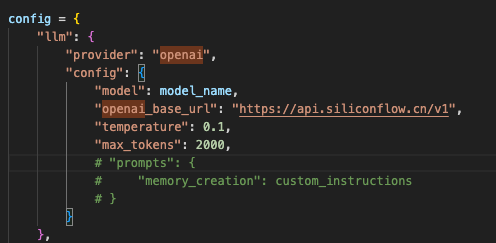
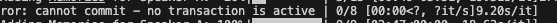
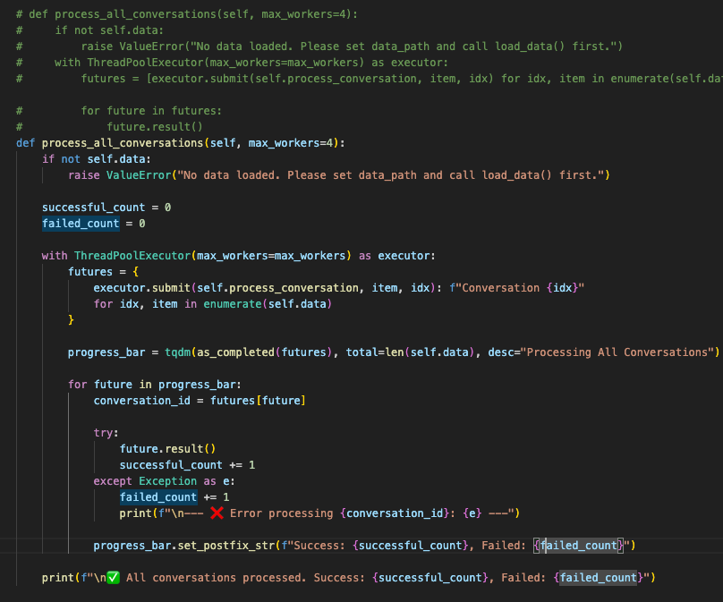
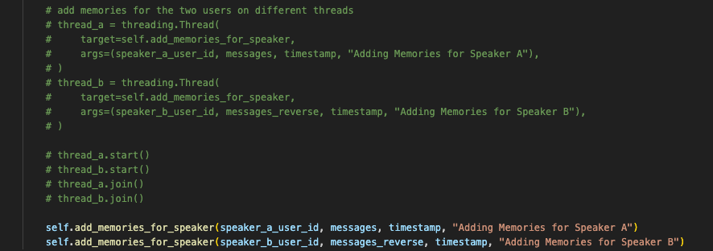
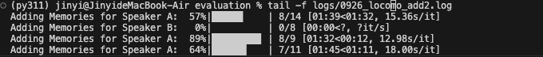

# 1. 修改评估过程

## memoryclient -> memory class

本地评估需要将memory client class切换到memory class，但是官方没提供代码，所以这里需要修改。

但是，client请求的参数和本地memory类请求的方式略有差异，这里记录如下，这些差异可能会导致性能结果上的差异。

1. prompt不能对齐，无法得知server端对prompt的处理细节
TypeError: OpenAIConfig.__init__() got an unexpected keyword argument 'prompts'


-> 可能的问题：json格式输出异常发生频率较高。


还有一些我新增的enhancement

1. 输出格式做了优化
2. 原本的评测没有对error做处理，直接退出，很不可靠。我做了优化，retry处理

## 运行脚本

nohup python run_experiments.py --technique_type mem0 --method add > logs/0926_locomo_add.log 2>&1 &

nohup python run_experiments.py --technique_type mem0 --method search > logs/0926_locomo_search.log 2>&1 &

# 2. 细节优化
1. 输出进度条优化
2. 对异常处理的优化，重试间隔建议random.randint(20, 60)


# 3. 线程安全 <-本地add操作并发复杂，经常奔溃报错
代码中存在嵌套并发：外层使用ThreadPoolExecutor处理多个对话，内层process_conversation函数中又为每个对话的两位参与者创建了两个threading.Thread。
所有这些并发的线程（来自线程池的worker线程和手动创建的线程）共享同一个self.memory实例。如果Memory.from_config(config)创建的实例及其内部组件（特别是与Qdrant数据库的连接和操作）不是线程安全的，那么在高并发下极有可能出现数据竞争、数据损坏或程序崩溃等问题。需关注。



**解决方案：**

## retry来解决

## 在最外层处理all conversation的时候没有异常处理机制，这里做优化
当一个任务失败时，我们捕获异常，打印出哪个任务失败了以及失败的原因，然后循环会继续处理下一个已完成的任务。


## 移除内部的线程并发




# 4. Membench测试集合并

合并后的数据：```evaluation/dataset/membench824.json```

合并后的相关统计量：```evaluation/dataset/Membench/readme.md```

# 5. LLM输出等log重构

# 6. 竞态
 Collection mem0 not found 的错误。

这是一个非常典型的并发问题，通常被称为**“竞态条件”（Race Condition）**。当多个线程（您的代码中是 ThreadPoolExecutor 创建的多个工作线程）同时尝试初始化或修改同一个共享资源时，就会发生这种情况。

问题根源：多线程同时“建房子”
我们可以把 Qdrant 向量数据库里的 Collection 理解为一张数据表，或者一个“房子”。您的代码流程是这样的：

启动多位工人：ThreadPoolExecutor 就像一个包工头，同时派出了多个工人（线程）去处理不同的 Conversation。

工人们接到指令：每个工人的任务是 process_conversation。在这个任务里，第一步是 self.memory.delete_all()，然后是 self.add_memory()。

混乱的施工现场：

mem0 库在第一次被使用时，会检查指定的路径下（qdrant_path）有没有一个叫做 mem0 的“房子”（Collection）。

因为是并行处理，所有工人几乎在同一时刻到达施工现场，都发现：“咦，这里没有叫 mem0 的房子！”

于是，所有工人都试图同时开始打地基、建房子（创建 Collection）。

Qdrant 的本地文件存储系统（on-disk storage）在这种情况下会陷入混乱。第一个工人可能成功创建了文件并锁定了它，其他工人此时再尝试创建就会失败，因为文件已经被占用了。或者，多个线程同时操作文件系统导致了数据不一致。

那些建房子失败的工人，接下来执行 add_memory() 往房子里放家具时，自然就报错了：“你要我找的 mem0 房子根本不存在啊！” (Collection mem0 not found)。

delete_all 操作也存在同样的问题，多个线程同时删除和重建，极易导致文件系统状态不一致。

解决方案：先建好房子，再让工人们进场
解决这个问题的核心思想是：将一次性的初始化工作，从并发任务中剥离出来，在主线程中预先完成。

我们需要在 add.py 的 process_all_conversations 方法中，进入 ThreadPoolExecutor 之前，确保 mem0 这个 Collection 已经被创建好。

文件: src/memzero_wo_client/add.py

修改建议：

在 process_all_conversations 方法中，with ThreadPoolExecutor(...) 语句块 之前，添加一步“预初始化”操作。最简单的方法就是执行一次无害的 add 操作，并立即删除，以此来强制 mem0 库完成 Collection 的创建。

# 7. 匿名事件记录要关闭

默认：

```MEM0_TELEMETRY = os.environ.get("MEM0_TELEMETRY", "True")```

因此需要：

```os.environ["MEM0_TELEMETRY"] = "False"```
