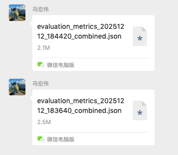

# 0000 vs. 149147 

## 1. 149147：“逐句/逐动作切片型（extractive-ish）”

特征是把对话当成“事件流”在记：大量 X said/asked、直接引语、碎片动作、甚至把语气词也记进去。比如在 Ethan 相关记忆里，会出现这种几乎等同转写的条目：Ethan said, 'Ohh.'、Ethan said, 'This guy says hello, I wanna kill myself.' 并且会把“原话标注/推测”也塞进记忆（这会引入不确定性和噪声）：例如带 speculation 的条目 

结果：信息非常“细”，但不归纳、不结构化，对“性格/风格/类型题”需要模型二次总结，难度上升。

## 2. 0000：“状态/画像抽象型（abstractive profile-ish）”

特征是把对话总结成“状态/人格倾向/关系描述”，少引语、多断言，像在写人物小传。比如会写成：Ethan 对别人提供支持、住哪、谁经常不在等更“画像式”的描述。同时它更容易出现元叙事/占位符式的“User”句子（很危险）：例如出现 User's name is Paul 这类条目，在多角色场景下非常容易把“角色”和“User 占位符”搅乱。

结果：对“风格/性格题”通常更友好，但更容易过度解释或出现“看似合理但并非对话事实”的总结（幻觉风险）。

## 3. 两者共同问题：跨角色污染 & 重复占预算

两个文件里都能看到：某个角色的 memory 列表里混入了别人的事件/信息，导致“每个 speaker 的 30 条配额”被重复信息吃掉。例如 183640 里 Waitress 的记忆直接包含 Chloe/Bennett/Ethan 的行为与想法；

184420 里甚至 Fiona 的 memories 也在大量重复 Ariel 的叙事（同一句反复出现在多个 speaker 下）

# 下面我把两个文件（`183640_combined` vs `184420_combined`）里“记忆写法”的差异、以及这些差异如何直接导致错题，拆开讲清楚。

---

## 1) 两种记忆存储风格/粒度到底差在哪

### A. `183640`：**“逐句/逐动作切片型（extractive-ish）”**

特征是把对话当成“事件流”在记：大量 **X said/asked**、直接引语、碎片动作、甚至把语气词也记进去。比如在 Ethan 相关记忆里，会出现这种几乎等同转写的条目：`Ethan said, 'Ohh.'`、`Ethan said, 'This guy says hello, I wanna kill myself.'` 
并且会把“原话标注/推测”也塞进记忆（这会引入不确定性和噪声）：例如带 `speculation` 的条目 。

**结果**：信息非常“细”，但**不归纳、不结构化**，对“性格/风格/类型题”需要模型二次总结，难度上升。

---

### B. `184420`：**“状态/画像抽象型（abstractive profile-ish）”**

特征是把对话总结成“状态/人格倾向/关系描述”，少引语、多断言，像在写人物小传。比如会写成：Ethan 对别人提供支持、住哪、谁经常不在等更“画像式”的描述 。
同时它更容易出现**元叙事/占位符式**的“User”句子（很危险）：例如出现 `User's name is Paul` 这类条目 ，在多角色场景下非常容易把“角色”和“User 占位符”搅乱。

**结果**：对“风格/性格题”通常更友好，但更容易**过度解释**或出现“看似合理但并非对话事实”的总结（幻觉风险）。

---

### C. 两者共同问题：**跨角色污染 & 重复占预算**

两个文件里都能看到：某个角色的 memory 列表里混入了别人的事件/信息，导致“每个 speaker 的 30 条配额”被重复信息吃掉。
例如 `183640` 里 Waitress 的记忆直接包含 Chloe/Bennett/Ethan 的行为与想法 ；
`184420` 里甚至 Fiona 的 memories 也在大量重复 Ariel 的叙事（同一句反复出现在多个 speaker 下）。

---

## 2) 很多题做错的主要原因是什么（按“致错链路”归因）

### 原因 1：**关键“稳定属性”根本没被写进记忆**

很多题目问的是“职业身份/擅长领域/核心自我标签”这种**稳定属性**，但两套记忆都更爱记“当下对话片段”，结果就是：记忆里压根没有答案所需的“锚点事实”，只能输出 F 或乱猜。

* 例：问 **Chloe 的职业自我定义（正确是厨师）**，最终只能给出“Cannot infer” ——因为你给它的记忆片段主要在讲婚礼/情绪/闲聊，并没有“她是 chef”的稳定事实。
* 例：问 **Ethan 自我介绍最核心身份（正确是 actor）**，`183640` 的最终回答是 F ；同时你能看到它“证据区”给的几条记忆基本都是语气词/玩笑/家具安装相关碎片，根本不含“actor”标签 。

> 本质：**写入阶段的“选取目标”没对齐评测题型**（评测要 stable profile，你写入给的是 chat snippets）。

---

### 原因 2：**粒度不匹配导致“可推理性”很差**

* `183640` 把信息切得太碎：对“风格/类型题”（例如“日常生活技能像哪种人”）模型需要先把几十条对话碎片做二次归纳，推不动就倾向 F 或猜错。
  例如 Ariel 的“生活技能类型题”，答案是“从小被照顾、不会做家务/咖啡”但系统给出的选择在多次跑里都偏离 ；从它提供的 memories 看，主要是“买靴子/面试失败/信用卡爸爸付钱”等片段，缺乏“不会做家务”的直接证据 。
* `184420` 虽然更画像化，但也会把“可验证事实”总结成“情绪/状态”，在“需要硬证据”的题上同样会缺锚点。

---

### 原因 3：**跨角色污染 + 重复，挤掉了真正有用的记忆槽位**

当 “每个 speaker 固定 30 条”时，如果大量条目在不同 speaker 下重复、或者把别人的信息塞进来，就会发生：

* **同一条事实在多个 speaker 重复** → 浪费配额
* **每个 speaker 的“独特信息密度”下降** → 问到他/她的独特点时就空了

这在两个文件里都很明显（见上面的 Waitress 示例 ，以及 Fiona 重复 Ariel 的示例 ）。

---

### 原因 4：`184420` 的副作用——**过度解释/幻觉式总结会误导**

`184420` 更爱把内容“解释成某种语境”，例如把某些行为解释成“与 cutting 相关的象征动作”等 ，或者出现“暗示创作/剪辑语境”这种无根推断 。
这种条目一旦写进 memory，会在检索阶段被当作“事实证据”使用，直接带偏选择题。

---

### 原因 5：**回答格式/策略偶发跑偏（与记忆风格耦合）**

你也能看到某些 run 会输出“解释+Answer: X”但选择错，导致评分为 0（即便看起来很“自信”）；甚至还会凭空引用“12 March 2023 的记忆”来论证一个领域结论 。
这类更多是**提示词约束/输出格式**与“更叙事化的记忆文本”相互作用导致的（不是唯一主因，但会放大错误）。

---

## 3) 一句话总结“为什么会错这么多”

* `183640`：**记得太碎太像转写** → stable profile 缺失、推理成本高、容易 F。
* `184420`：**记得更像人物画像** → 性格题更友好，但容易“User 指代混乱/过度总结幻觉”，且稳定职业/领域锚点仍缺失。
* 两者共同：**跨角色污染 + 重复占预算** → 真正区分角色的关键信息被挤掉。

如果你愿意，我可以按“错题类型→需要的记忆字段→当前缺失点”给你做一个更工程化的归因清单，并直接建议“写入层该怎么把同一段对话同时生成：事件记忆 + 画像记忆 + 结构化属性（key-value/graph）”，这样能把这些题的 F 大幅压下去。
