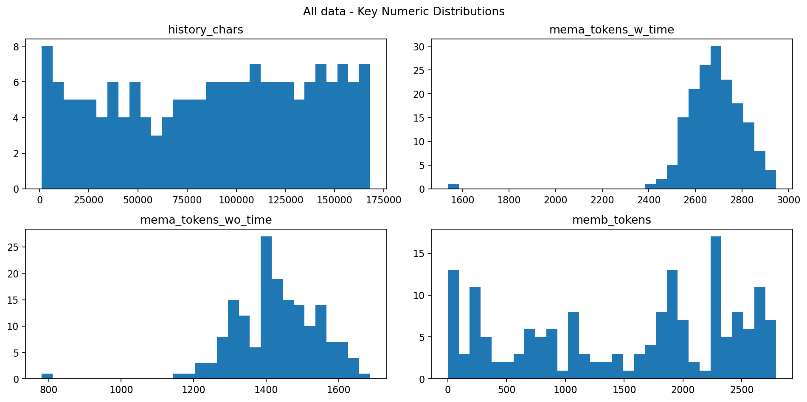
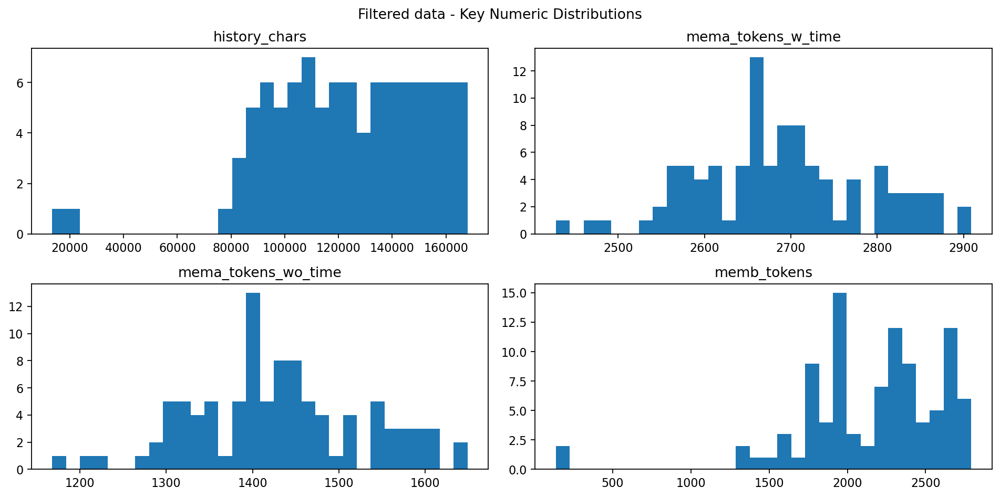
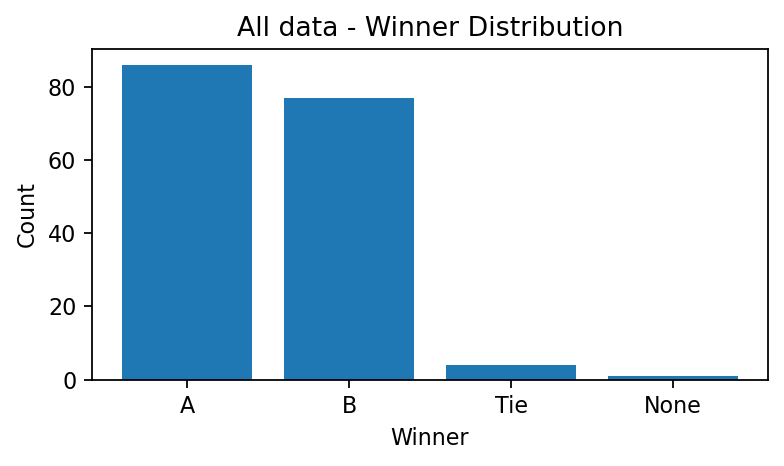
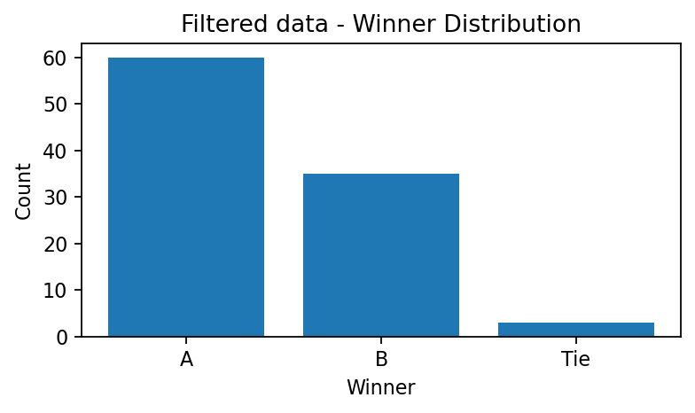
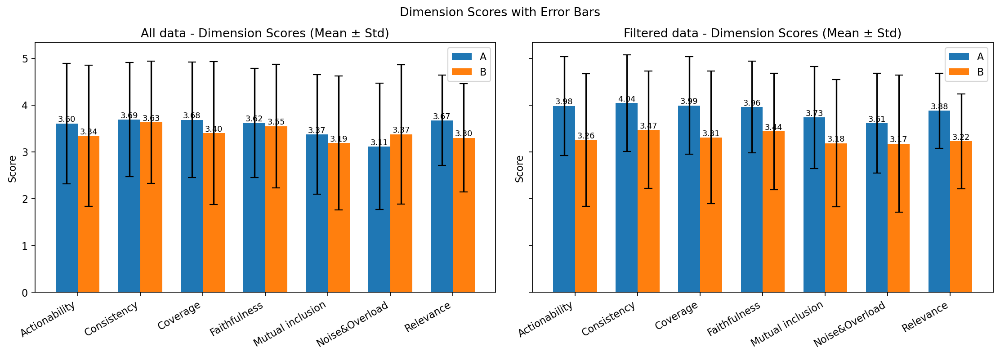
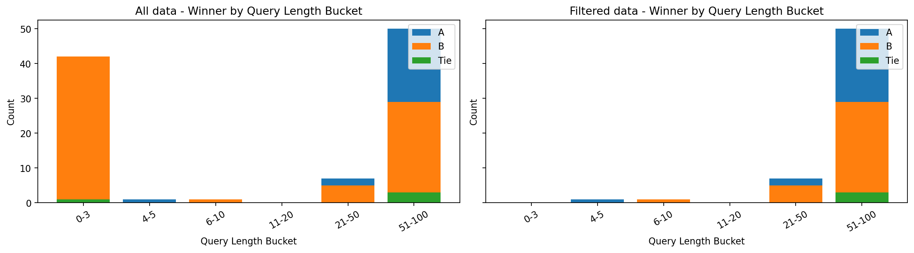

# Evaluation Results Report

## 1. 数据概览
- 原始总行数：168
- 筛选后行数：98
- 低信息 query 数量：59
- 中文字符数少于 4 的条目：70

## 2. 关键字段直方图

**All data**

**Filtered data**

> 结论：我们框架下，token显著更低

## 3. 胜者统计

**All data**

**Filtered data**

> 结论：我们框架下，memory总体表现更好。在除去信息量低的qwery数据后，优势更显著。

## 4. 各维度得分

## 5. query 长度分桶下的胜者分布变化

> 结论：我们框架的优势明显。而在低信息量的情况下，框架难以检索出相关数据，但是产品本身可以增量式提供信息，因此得分更高。