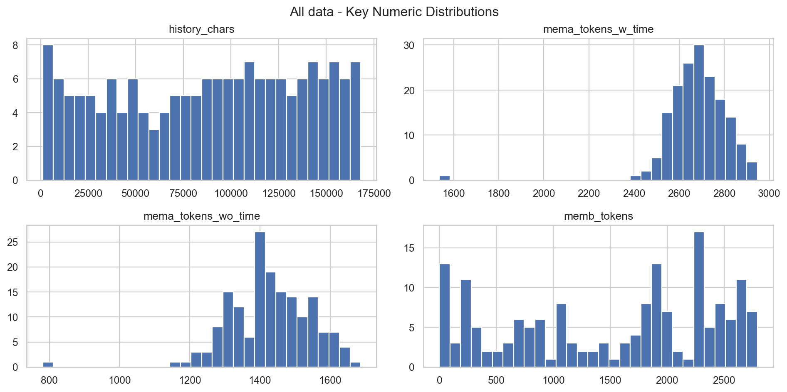
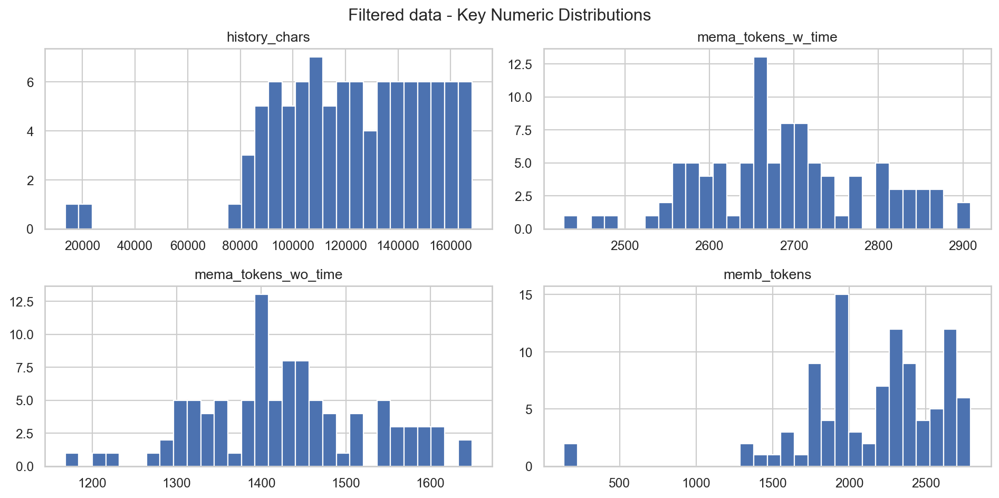
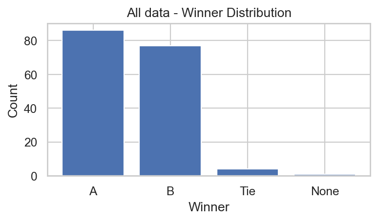
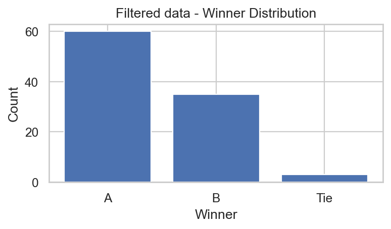
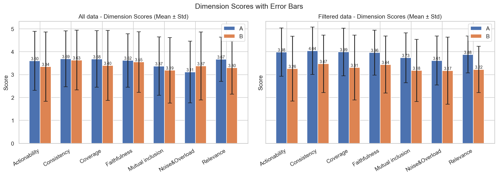
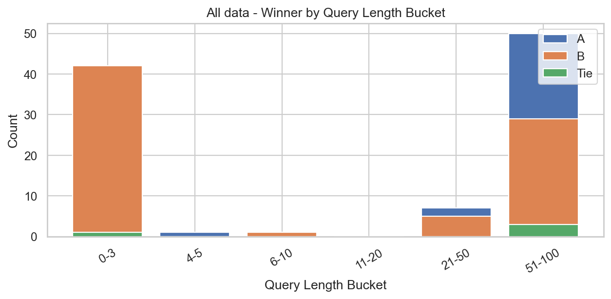
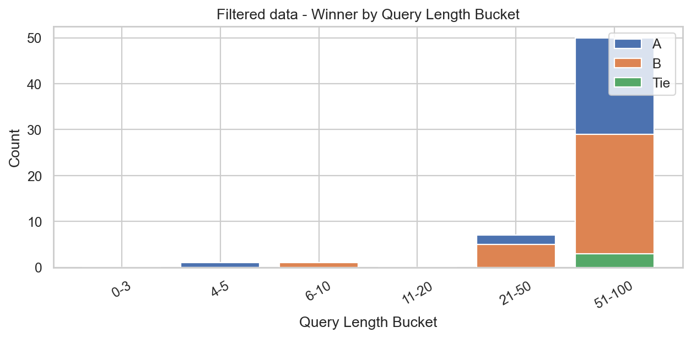

# Evaluation Summary (eval_merged_v2.jsonl)

## 1. 数据概览
- 原始总行数：168
- 筛选后行数：98
- 低信息 query 数量：59
- 中文字符数少于 4 的条目：70

## 2. 关键字段直方图

**All data**

**Filtered data**

## 3. 胜者统计

**All data**

**Filtered data**

## 4. 各维度得分

## 5. query 长度分桶下的胜者分布变化

**All data**

**Filtered data**

## 结论

